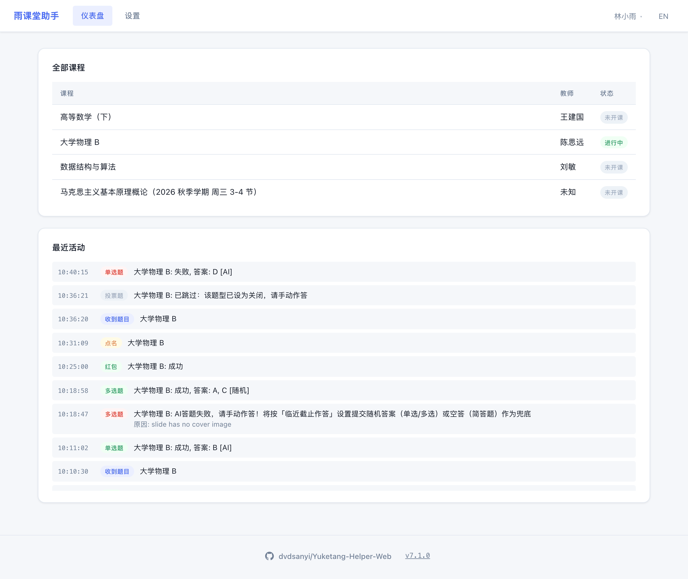
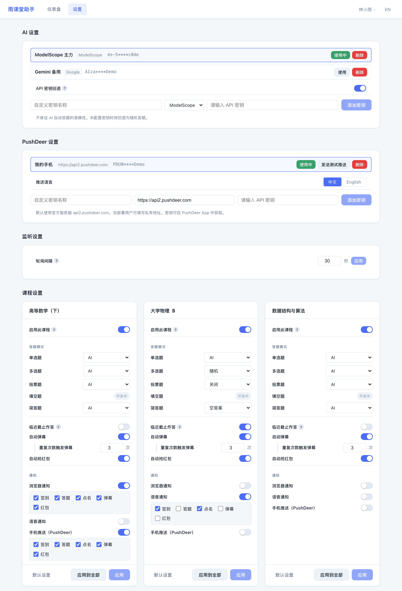
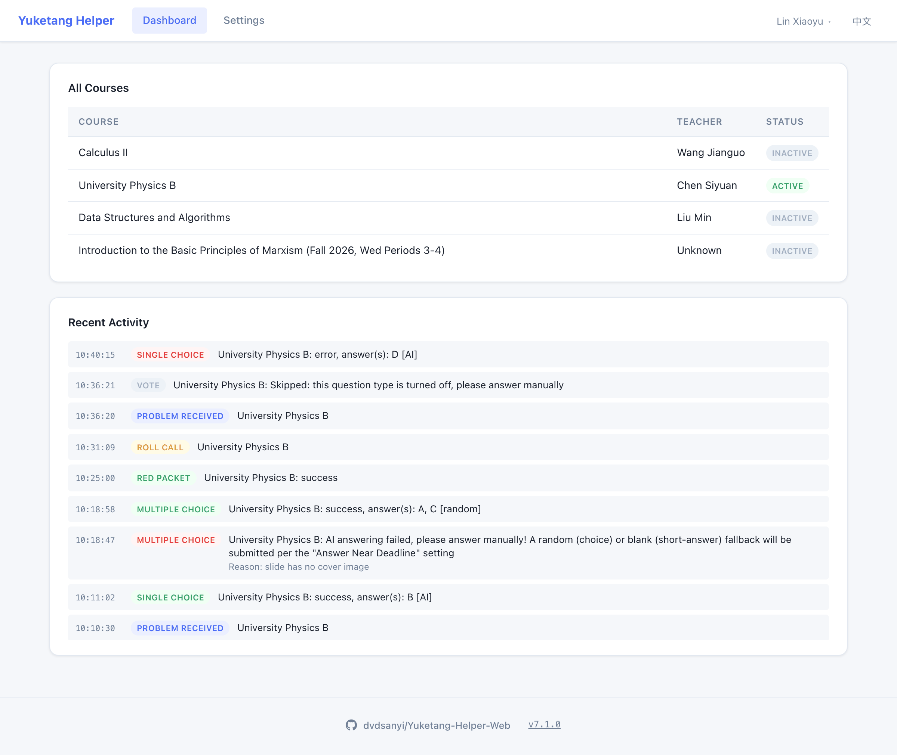
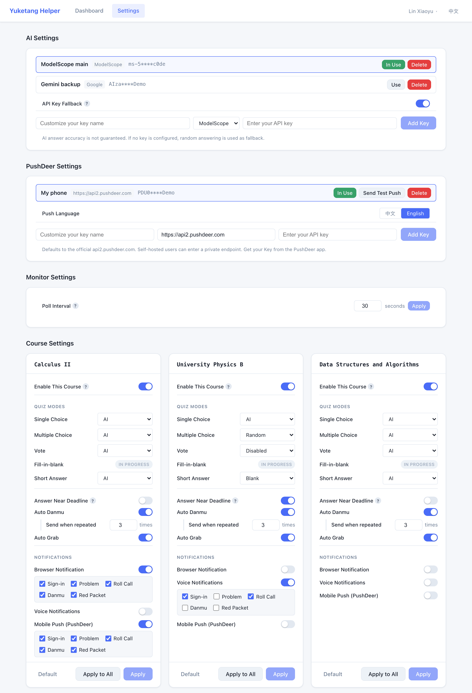

# 雨课堂助手 Web 版

- 基于 [RainClassroomAssitant](https://github.com/TrickyDeath/RainClassroomAssitant) 和 THU-Yuketang-Helper

<picture>
  <source media="(prefers-color-scheme: dark)" srcset="docs/screenshots/dashboard-zh-dark.png">
  
</picture>

<details>
<summary>设置页面</summary>

<picture>
  <source media="(prefers-color-scheme: dark)" srcset="docs/screenshots/settings-zh-dark.png">
  
</picture>

</details>

## 功能

- **自动签到** — 自动完成签到（**模拟通过 APP 扫二维码进入课堂**）
- **自动答题** — 支持单选、多选、投票和简答题，可配置答题策略（随机、空白或 AI）
- **自动弹幕** — 当一段时间内出现超过特定条数的相同弹幕时自动跟发
- **自动抢红包** — 收到红包时自动抢
- **点名提醒** — 点名时发送通知提醒
- **语音通知** — 支持语音播报课程事件
- **手机推送** — 支持 PushDeer 将课堂事件和登录过期推送到手机（支持自建服务器）
- **分课程设置** — 对每门课程进行精细化的自动化控制
- **多服务器支持** — 支持多个雨课堂服务器
- **多账号支持** — 支持同时登录多个账号
- **多平台支持** — 提供 Windows、macOS、Linux 可执行文件，支持 Python 源码运行和 Docker 部署
- **双语界面** — 支持中英文切换

## 快速开始

### 方式一：可执行文件（普通用户推荐）

1. 前往 [Releases 页面](https://github.com/dvdsanyi/Yuketang-Helper-Web/releases)，下载对应平台的可执行文件
2. 运行可执行文件，浏览器会自动打开 <http://localhost:8500>

> [!TIP]
> macOS/linux 用户需先运行 `chmod +x YuketangHelper-<OS>-<VERSION>`（自行补全文件名）; macOS 用户如遇安全提示请前往 **系统设置 → 隐私与安全性** 点击"仍要打开"

### 方式二：Python（开发者推荐）

1. [下载源代码 ZIP](https://codeload.github.com/dvdsanyi/Yuketang-Helper-Web/zip/refs/heads/main) 并解压，或使用 Git Clone
1. 安装 [Python 3.14](https://www.python.org/) 和 [Node.js 26](https://nodejs.org/)
1. 在项目根目录下运行：

   ```zsh
   python start.py
   ```

1. 在浏览器中打开 <http://localhost:5173> 即可使用

### 方式三：Docker（服务器部署推荐）

1. 下载并安装 Docker
1. 打开 Docker 并拉取镜像 `docker pull dvdyyz/yuketang-helper:latest`
1. 运行：

   ```zsh
   docker run -d --name yuketang-helper --restart unless-stopped -p 8500:8500 -v yuketang-data:/data dvdyyz/yuketang-helper:latest
   ```

1. 在浏览器中打开 <http://localhost:8500> 即可使用

> [!TIP]
> 服务器部署可通过端口转发在本地浏览器访问；
> 雨课堂 Session 的有效期为 2 周，过期后需重新登录（配置了 PushDeer 会收到提醒）。

## 停止

- **可执行文件**：关闭终端窗口
- **Python**：运行 `python stop.py`
- **Docker**：运行 `docker stop yuketang-helper`

## 日志

运行日志写入数据目录下的 `logs/app.log`，超过 2 MB 自动轮转，保留最近 3 份：

- **可执行文件**：macOS `~/Library/Application Support/Yuketang Helper/logs/`，Windows `%LOCALAPPDATA%\Yuketang Helper\logs\`，Linux `~/.local/share/Yuketang Helper/logs/`
- **Python**：项目根目录下的 `store/logs/`
- **Docker**：数据卷中的 `/data/logs/`，可运行 `docker exec yuketang-helper tail -n 200 /data/logs/app.log` 查看

## 获取 AI API密钥（免费）

- **ModelScope**: 登录 [ModelScope](https://modelscope.cn/)，前往[访问控制](https://modelscope.cn/my/access/token)，点击 **新建访问令牌**

> [!IMPORTANT]
> 使用 ModelScope API 需同时满足以下两点，否则即使创建了访问令牌也无法调用模型 API，本助手会调用失败：
>
> 1. **在 ModelScope [账号设置](https://modelscope.cn/my/settings/account) 中绑定阿里云账号**
> 2. **完成实名认证**

- **Google**: 登录 [Google AI Studio](https://aistudio.google.com/)，进入 [Get API Key page](https://aistudio.google.com/api-keys)，点击 **Create API Key**

## 构建（开发者）

```zsh
cd frontend && npm ci && npm run build && cd ..
pip install -r backend/requirements.txt pyinstaller
pyinstaller YuketangHelper.spec
```

可执行文件生成在 `dist/` 下。推送 `v*` 标签后，GitHub Actions 会自动构建各平台的可执行文件和 Docker 镜像并发布 Release。

---

# Yuketang Helper Web

- Based on [RainClassroomAssitant](https://github.com/TrickyDeath/RainClassroomAssitant) and THU-Yuketang-Helper

<picture>
  <source media="(prefers-color-scheme: dark)" srcset="docs/screenshots/dashboard-en-dark.png">
  
</picture>

<details>
<summary>Settings page</summary>

<picture>
  <source media="(prefers-color-scheme: dark)" srcset="docs/screenshots/settings-en-dark.png">
  
</picture>

</details>

## Features

- **Auto Sign-in** — Automatically checks in (**simulates scanning the QR code via the app to enter the classroom**)
- **Auto Quiz Answering** — Handles single/multiple choice, voting, and short-answer questions with configurable strategies (random, blank, or AI)
- **Auto Danmu** — Automatically follows up when more than a configured number of identical danmu appear within a period of time
- **Auto Red Packet** — Automatically grabs red packets when received
- **Roll Call Notifications** — Alerts you when roll call happens
- **Voice Notifications** — Text-to-speech announcements for lesson events
- **Mobile Push** — Push lesson events and session expiry to your phone via PushDeer (self-hosted servers supported)
- **Per-Course Settings** — Fine-grained control over automation for each course
- **Multi-Server Support** — Supports multiple Yuketang servers
- **Multi-Account Support** — Supports logging in with multiple accounts simultaneously
- **Multi-Platform Support** — Provides Windows, macOS, and Linux executables, with support for Python source and Docker deployment
- **Bilingual UI** — English and Chinese interface

## Quick Start

### Option 1: Executable (Recommended for Ordinary Users)

1. Go to the [Releases page](https://github.com/dvdsanyi/Yuketang-Helper-Web/releases) and download the executable for your platform
2. Run the executable — your browser will automatically open <http://localhost:8500>

> [!TIP]
> macOS/Linux users: run `chmod +x YuketangHelper-<OS>-<VERSION>` first (replace with actual filename); macOS users: if you see a security warning, go to **System Settings → Privacy & Security** and click "Open Anyway"

### Option 2: Python (Recommended for Developers)

1. [Download source code ZIP](https://codeload.github.com/dvdsanyi/Yuketang-Helper-Web/zip/refs/heads/main) and extract, or use Git Clone
1. Install [Python 3.14](https://www.python.org/) and [Node.js 26](https://nodejs.org/)
1. Run the following command in the project root directory:

   ```zsh
   python start.py
   ```

1. Open <http://localhost:5173> in your browser to use the app

### Option 3: Docker (Recommended for Server Deployments)

1. Download and install Docker
1. Open Docker and pull the image `docker pull dvdyyz/yuketang-helper:latest`
1. Run:

   ```zsh
   docker run -d --name yuketang-helper --restart unless-stopped -p 8500:8500 -v yuketang-data:/data dvdyyz/yuketang-helper:latest
   ```

1. Open <http://localhost:8500> in your browser to use the app

> [!TIP]
> Server deployments can be accessed from a local browser via port forwarding;
> Yuketang Sessions are valid for 2 weeks; log in again after that (PushDeer notifies you if configured).

## Stop

- **Executable**: Close the terminal window
- **Python**: Run `python stop.py`
- **Docker**: Run `docker stop yuketang-helper`

## Logs

Logs are written to `logs/app.log` in the data directory, rotated at 2 MB with the last 3 files kept:

- **Executable**: macOS `~/Library/Application Support/Yuketang Helper/logs/`, Windows `%LOCALAPPDATA%\Yuketang Helper\logs\`, Linux `~/.local/share/Yuketang Helper/logs/`
- **Python**: `store/logs/` in the project root
- **Docker**: `/data/logs/` in the data volume; view with `docker exec yuketang-helper tail -n 200 /data/logs/app.log`

## Get AI API Key (Free)

- **ModelScope**: Log in at [ModelScope](https://modelscope.cn/), go to [Access Control](https://modelscope.cn/my/access/token) and click **Create Your Token**

> [!IMPORTANT]
> Using the ModelScope API requires **both** of the following; otherwise model API calls will fail even with a valid access token, and this helper will not be able to answer with AI:
>
> 1. **Bind an Alibaba Cloud account in ModelScope [Account Settings](https://modelscope.cn/my/settings/account)**
> 2. **Complete real-name verification**

- **Google**: Log in at [Google AI Studio](https://aistudio.google.com/), go to the [Get API Key page](https://aistudio.google.com/api-keys), and click **Create API Key**

## Build (Developers)

```zsh
cd frontend && npm ci && npm run build && cd ..
pip install -r backend/requirements.txt pyinstaller
pyinstaller YuketangHelper.spec
```

The executable is written to `dist/`. Pushing a `v*` tag makes GitHub Actions build the executables for every platform plus the Docker image, and publish a Release.
